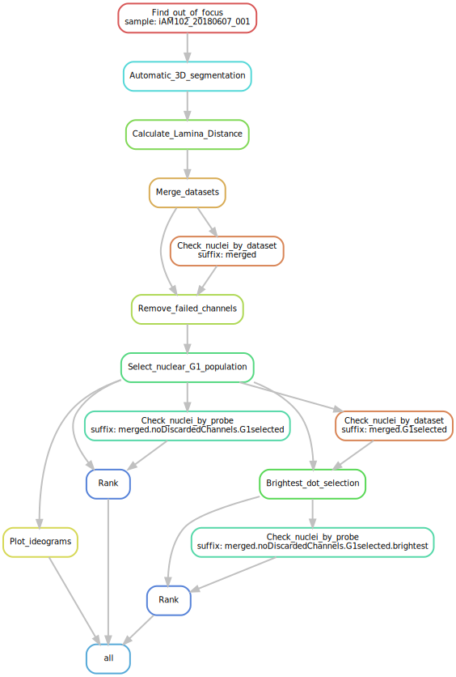

# iFISH-singleLocus-analysis
Pipeline for iFISH single locus data analysis.

### Motivation

Standard iFISH single locus data analysis pipeline controlled by snakemake, a workflow management system tool to create reproducible and scalable data analyses.

### Requirements

* [pygpseq](https://github.com/ggirelli/pygpseq)
* [snakemake](https://snakemake.readthedocs.io/en/stable/)

## Setup and run

IMPORTANT: before running the pipeline modify the config.yaml according to your needs, or create a new one. You can run the standard workflow using: `snakemake --configfile=<your config file>`.

#### Config file parameters

* **Input** parameters are explained in the relative section below.
* **Output**
* **Lamina distance**
* **Samples**

### Input

#### Deconvolved images, by Huygens (or similar)

Create a subfolder in `input`, where you will place a folder for each dataset. The absolute path to this folder should be specified in the `config.yaml` file as `deconvolved_root_folder`. The folder name <u>must</u> match the dataset name. Each dataset folder should contain the deconvolved tiff images, alongside a `<channel>_<ID>_history.txt` file containing the deconvolution log.

#### Automatically picked userDots

Create a subfolder in `input`, where you will place the automatically picked userDots tables generated with DOTTER. Each file should have the following name format: `<dataset>_auto_userdots.csv`. The absolute path to this folder should be specified in the `config.yaml` file as `auto_userdots_folder`.

### Workflow

